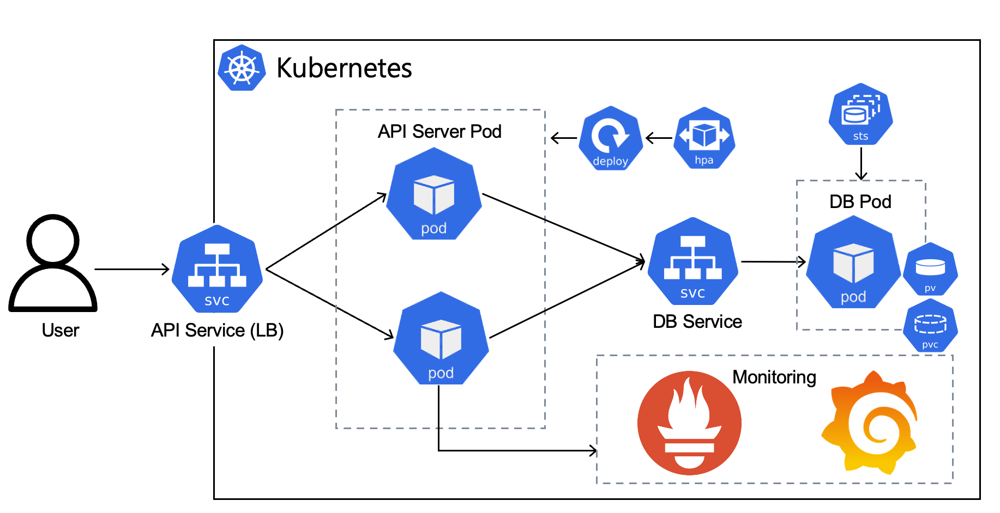
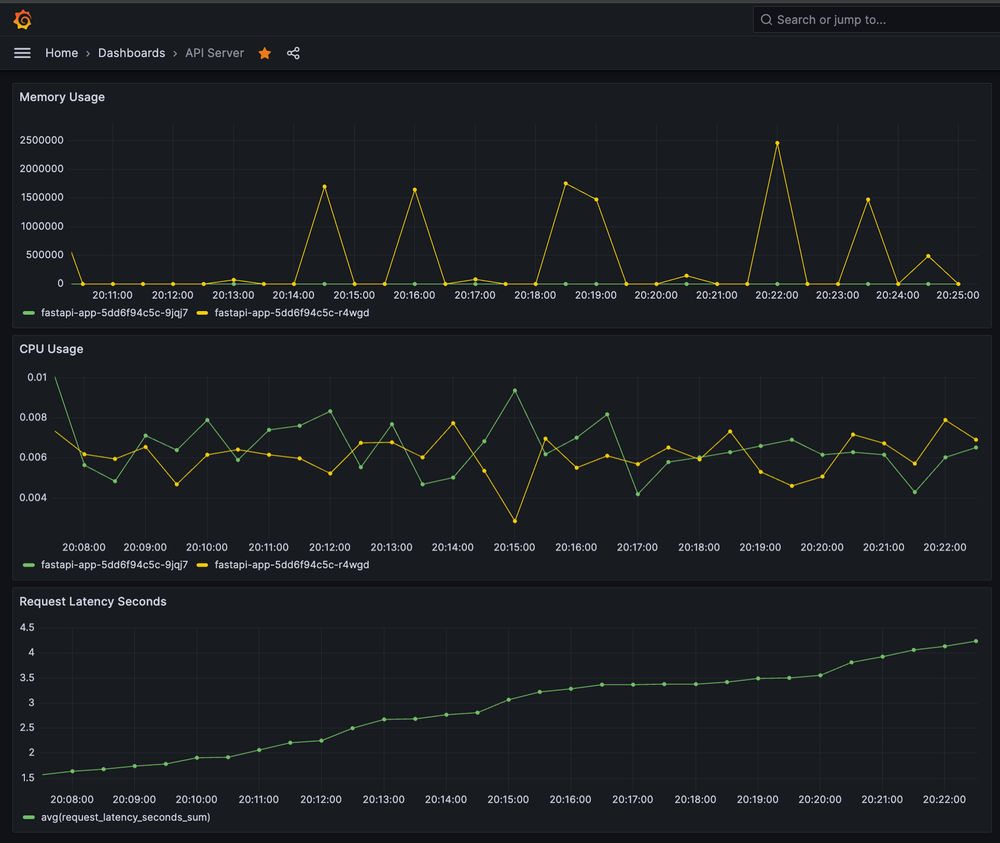

# 인프라 구성에 대한 코드와 설명


## 0. 개요

 Terraform과 를 Helm Chart를 사용하여 로컬 Minikube에 배포하였으며, Prometheus를 통해 수집한 메트릭을 Garafana로 시각화 하였습니다.

## 1. 코드 구조

```
k8s_monitoring_terraform/
├── k8s_monitoring/
│   ├── Chart.yaml
│   ├── charts/
│   │   └── kube-prometheus-stack-51.2.0.tgz
│   ├── templates/
│   │   ├── configmap.yaml
│   │   ├── deployment-fastapi.yaml
│   │   ├── statefulset-postgres-postgres.yaml
│   │   ├── hpa-fastapi.yaml
│   │   ├── pvc-postgres.yaml
│   │   ├── secret.yaml
│   │   ├── service-fastapi.yaml
│   │   ├── service-postgres.yaml
│   │   └── servicemonitor-fastapi.yaml
│   └── values.yaml
└── terraform/
    ├── main.tf
    ├── outputs.tf
    ├── provider.tf
    └── variables.tf
```

## 3. 아키텍처



## 4. 코드 설명

### **4.1 Terraform 코드**

Terraform 코드는 Minikube 네임스페이스 및 Helm 차트를 자동으로 배포하기 위해 작성되었습니다.

1. **`main.tf`**:
    - `kubernetes_namespace`: `monitoring`이라는 네임스페이스를 생성합니다.
    - `helm_release`: Helm을 사용하여 `k8s_monitoring` 차트를 네임스페이스에 배포합니다.
    - `values.yaml`을 참조하여 사용자 지정 값을 제공합니다.
2. **`variables.tf`**:
    - 변수 정의 파일로, `minikube_context` 변수를 정의하여 Minikube 환경에서 실행할 수 있도록 지원합니다.
3. **`provider.tf`**:
    - Kubernetes와 Helm 프로바이더를 설정합니다.
    - `~/.kube/config`를 사용하여 Minikube 클러스터에 연결합니다.
4. **`outputs.tf`**:
    - 배포 후 Helm 릴리스 상태 및 네임스페이스 이름을 출력합니다.

### **4.2 Helm Chart**

Helm 차트는 FastAPI 애플리케이션과 PostgreSQL 데이터베이스를 Minikube 환경에 배포하기 위한 템플릿을 포함하고 있습니다.

1. **`Chart.yaml`**:
    - Helm 차트의 메타데이터 정의합니다.
    - rPometheus 기반 모니터링을 설정합니다.
2. **`values.yaml`**:
    - PostgreSQL 및 FastAPI 설정을 포함한 사용자 지정 값:
        - PostgreSQL은 1GB PVC를 사용하고, `postgres:13` 이미지를 사용합니다.
        - FastAPI는 2개의 Replica로 실행되고, HPA를 통해 최대 4개의 Replica까지 확장 가능합니다.
3. **템플릿 파일 (`templates/`)**:
    - PostgreSQL StatefulSet 및 PVC 설정 (`statefulset-postgres.yaml`, `pvc-postgres.yaml`).
    - FastAPI 배포 및 서비스 설정 (`deployment-fastapi.yaml`, `service-fastapi.yaml`).
    - HPA 설정 (`hpa-fastapi.yaml`) 및 Prometheus 모니터링 설정 (`servicemonitor-fastapi.yaml`).
    - `ConfigMap`과 `Secret`을 통해 데이터베이스와 FastAPI 간  ENV.를 관리.

## 5. Grafana를 이용한 메트릭 모니터링



- Memory, CPU 등 메트릭 을 수집하여 Grafana로 시각화하였습니다.